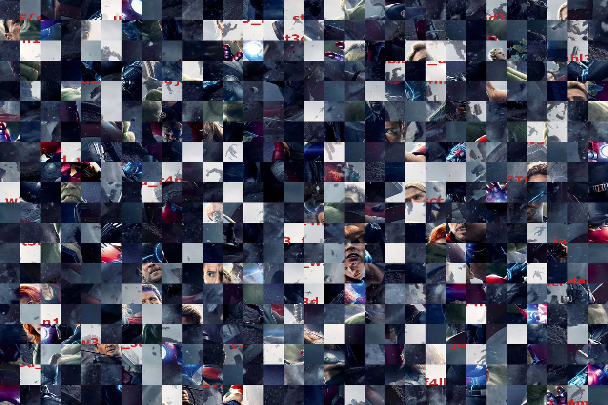

# Avengers, Assemble!
## DFIR (50 pts)

Writeup by danlliu (WolvSec)

## Challenge

We are given an image file, `scrambled.png`, and asked to find the flag.

## Solution

We can start by opening `scrambled.png`:



The flag has been added into the image, and then the 60x60 sections of the image scrambled! I started by splitting up these fragments individually:

```python
from PIL import Image

i = Image.open('scrambled.png')

width, height = i.size

for x in range(0, width, 60):
  for y in range(0, height, 60):
    box = (x, y, x + 60, y + 60)
    region = i.crop(box)
    region.save(f'{x}-{y}.png')
```

From here, the images without any flag fragments can be discarded, and the remaining fragments put together:

```python
from PIL import Image

names = [
  ['1620-660.png', '1680-780.png', '1500-480.png', '60-0.png', '1260-540.png', '1680-1140.png', '1680-120.png', '900-840.png', '0-540.png', '840-660.png', '1260-1080.png', '300-0.png', '120-900.png', '840-60.png', '180-420.png', '240-960.png', '840-0.png', '480-480.png', '1440-0.png'],
  ['1320-1020.png', '240-240.png', '600-1140.png', '660-1020.png', '1620-840.png', '1260-240.png', '1140-180.png', '60-1080.png', '900-780.png', '720-60.png', '1380-900.png', '1260-180.png', '60-120.png', '60-720.png', '420-540.png', '1560-420.png', '360-1020.png', '900-660.png', '480-240.png']
]

data = [[[0 for _ in range(len(names[0]) * 60)]] for _ in range(len(names) * 60)]

output = Image.new('RGB', (60 * len(names[0]), 60 * len(names)))

for i in range(len(names)):
  for j in range(len(names[i])):
    filename = names[i][j]
    try:
      r = Image.open(filename)
    except:
      r = Image.open('used/' + filename)
    output.paste(r, (j * 60, i * 60, (j + 1) * 60, (i + 1) * 60))

output.save('ofile.png')
```

The script above stitches together the fragments of the flag in the right order (with some manual matching of top and bottom); our final image is shown below!


`jadeCTF{scr4mbl3d_w3_f4ll_un1t3d_w3_st4nd}`
