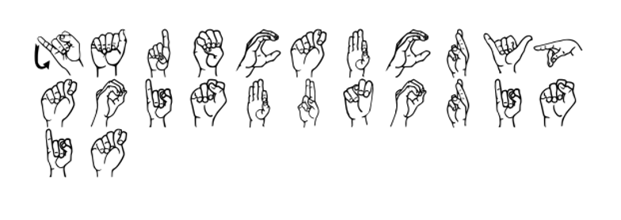

# hands
## Crypto (50 pts)

Writeup by danlliu (WolvSec)

## Challenge

We are given a file, `chall.png`.

## Solution

Opening the file shows us the following image:

This is a substitution cipher, using ASL letters to encode each letter of the flag. Decoding each symbol gives:

`jadectfcryptoisfunorisit`

Thus, the flag is `jadeCTF{cryptoisfunorisit}`
